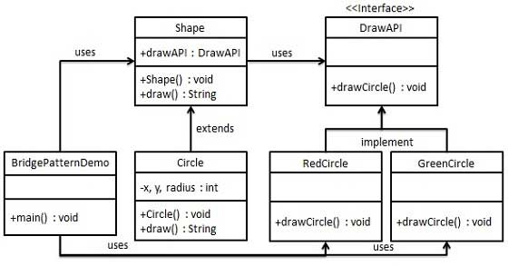
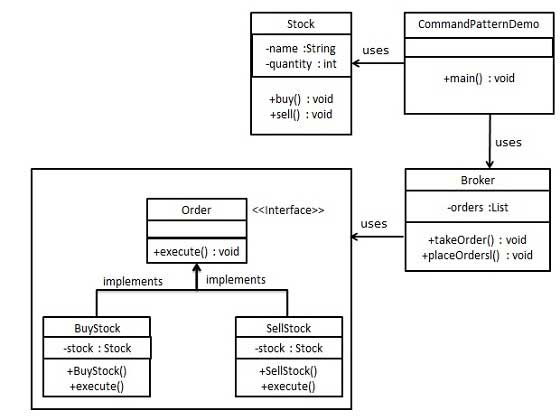
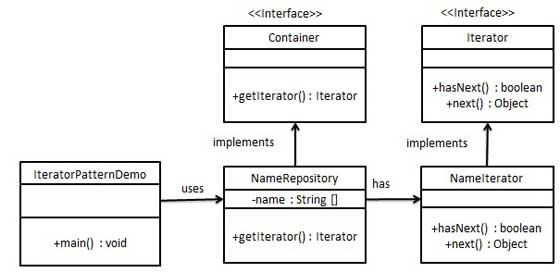
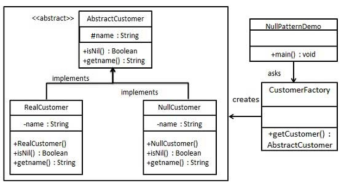
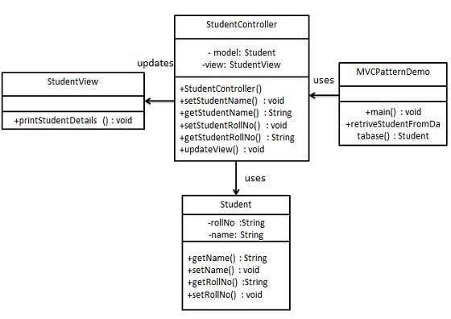

# Design Pattern
This repository includes the notes and examples from the [Design Pattern Quick Guide](https://www.tutorialspoint.com/design_pattern/design_pattern_quick_guide).

### Background
- According to initial authors design patterns are primarily based on the following principles.
    - Program to an interface not an implementation
    - Favor object composition over inheritance
- **Usage of Design Pattern**
    - Design patterns provide a standard terminology and are specific to particular scenario.
    - Design patterns provide best solutions to certain problems faced during software development.
- **Types of Design Pattern**
    - Creational Patterns
        - These design patterns provides way to create objects while hiding the creation logic, rather than instantiating objects directly using new operator. This gives program more flexibility in deciding which objects need to be created for a given use case.
    - Structural Patterns
        - These design patterns concern class and object composition. Concept of inheritance is used to compose interfaces and define ways to compose objects to obtain new functionalities.
    - Behavioral Patterns
        - These design patterns are specifically concerned with communication between objects.
    - J2EE Patterns
        - These design patterns are specifically concerned with the presentation tier. These patterns are identified by Sun Java Center.

   
## Creational Patterns
### Factory Pattern
- Factory Pattern is under creational pattern. It's under Creational Pattern.
- Implementation
    - In Factory pattern, we create object without exposing the creation logic to the client and refer to newly created object using a common interface.
    - [Factory Pattern Example](FactoryPattern)
    

### Abstract Factory Pattern
- Abstract Factory patterns work around a super-factory which creates other factories. This factory is also called as factory of factories. Under creational patterns.
- Implementation
    - [Abstract Factory Pattern Example](AbstractFactoryPattern)
        

### Singleton Pattern
- This pattern involves a single class which is responsible to creates own object while making sure that only single object get created. Under  creational pattern.
- Implementation
    - [Singleton Pattern Example](SingletonPattern)
     

### Builder Pattern
- Builder pattern builds a complex object using simple objects and using a step by step approach. This builder is independent of other objects. It is under creational pattern.
- Implementation : a business case of fast-food
- [Builder Pattern Example](BuilderPattern)
 

### Prototype Pattern
- Prototype pattern refers to creating duplicate object while keeping performance in mind. This pattern involves implementing a prototype interface which tells to create a clone of the current object. It is used when creation of object directly is costly. It is under creational pattern.
- For example, a object is to be created after a costly database operation. We can cache the object, returns its clone on next request and update the database when needed thus reducing database calls.
- [Prototype Pattern Example](PrototypePattern)
 
- [What is Interface Cloneable](https://docs.oracle.com/javase/7/docs/api/java/lang/Cloneable.html)

  
## Structural pattern
### Adapter Pattern
- Adapter pattern works as a bridge between two incompatible interfaces. It is under structural pattern.
- Implementation ：an audio player device can play mp3 files only and wants to use an advanced audio player capable of playing vlc and mp4 files.
    - [Adapter Pattern Example](AdapterPattern)
      

### Bridge Pattern
- Bridge Pattern is used where we need to decouple an abstraction from its implementation so that the two can vary independently. It is under structural pattern.
- This pattern involves an interface which acts as a bridge which makes the functionality of concrete classes independent from interface implementer classes. Both types of classes can be altered structurally without affecting each other.
- Implementation
    - [Bridge Pattern Example](BridgePattern)
     

### Filter/Criteria Pattern
- Filter pattern or Criteria pattern is a design pattern that enables developers to filter a set of objects, using different criteria, chaining them in a decoupled way through logical operations. This type of design pattern comes under structural pattern as this pattern is combining multiple criteria to obtain single criteria.
- [Filter/Criteria Pattern](FilterOrCriteria)
 

### Composite Pattern
- Composite pattern is used where we need to treat a group of objects in similar way as a single object. Composite pattern composes objects in term of a tree structure to represent part as well as whole hierarchy.
- This pattern creates a class contains group of its own objects. This class provides ways to modify its group of same objects.
- Implementation
    - [Composite Pattern Example](CompositePattern)
     

### Decorator Pattern
- Decorator pattern allows to add new functionality an existing object without altering its structure. This type of design pattern comes under structural pattern as this pattern acts as a wrapper to existing class.
- This pattern creates a decorator class which wraps the original class and provides additional functionality keeping class methods signature intact.
- Implementation
    - [Decorator Pattern Example](DecoratorPattern)
     

### Facade Pattern
- Facade pattern hides the complexities of the system and provides an interface to the client using which the client can access the system. This type of design pattern comes under structural pattern as this pattern adds an interface to exiting system to hide its complexities.
- This pattern involves a single class which provides simplified methods which are required by client and delegates calls to existing system classes methods.
- Implementation
 - [Facade Pattern Example](FacadePattern)
  

### Flyweight Pattern
 - Flyweight pattern is primarily used to reduce the number of objects created, to decrease memory footprint and increase performance. This type of design pattern comes under structural pattern as this pattern provides ways to decrease objects count thus improving application required objects structure.
 - Flyweight pattern try to reuse already existing similar kind objects by storing them and creates new object when no matching object is found. We'll demonstrate this pattern by drawing 20 circle of different locations but we'll creating only 5 objects.
 - Implementation
  - [Flyweight Pattern Example](FlyweightPattern)
   

### Proxy Pattern
- In Proxy pattern, a class represents functionality of another class. In Proxy pattern, we create object having original object to interface its functionality to outer world.
- Implementation
 - [Proxy Pattern Example](ProxyPattern)
  

   
## Behavioral Patterns

### Chain of Responsibility Pattern
- As the name suggest, the chain of responsibility pattern creates a chain of receiver objects for a request. This pattern decouples sender and receiver of a request based on type of request.
- In this pattern, normally each receiver contains reference to another receiver. If one object cannot handle the request then it passes the same to the next receiver and so on.
- Implementation
 - [Chain of Responsibility Pattern Example](ChainOfResponsibilityPattern)
  

### Command Pattern
- Command pattern is a data driven design pattern and falls under behavioral pattern category. A request is wrapped under a object as command and passed to invoker object. Invoker object looks for the appropriate object which can handle this command and pass the command to the corresponding object and that object executes the command.
- Implementation
 - [Command Pattern Example](CommandPattern)
  

### Interpreter Pattern
- Interpreter pattern provides way to evaluate language grammar or expression. This type of pattern comes under behavioral patterns. This pattern involves implementing a expression interface which tells to interpret a particular context. This pattern is used in SQL parsing, symbol processing engine etc.
- Implementation
    - [Interpreter Pattern Example](InterpreterPattern)
     

### Iterator Pattern
-  This pattern is used to get a way to access the elements of a collection object in sequential manner without any need to know its underlying representation. It is under behavioral pattern category.
- Java has [Iterator Interface](https://docs.oracle.com/javase/8/docs/api/java/util/Iterator.html).
- [Iterator Pattern Example](IteratorPattern)
 

### Mediator Pattern
- Mediator pattern is used to reduce communication complexity between multiple objects or classes. This pattern provides a mediator class which normally handles all the communications between different classes and supports easy maintainability of the code by loose coupling.
- [Mediator Pattern](MediatorPattern)
 

### Memento Pattern
- Memento pattern is used to reduce where we want to restore state of an object to a previous state.
- [Memento Pattern](MementoPattern)
-  

### Observer Pattern
- Observer pattern is used when there is one to many relationship between objects such as if one object is modified, its depenedent objects are to be notified automatically.
- [Observer Pattern](ObserverPattern)
-  

### State Pattern
- In State pattern a class behavior changes based on its state. This type of design pattern comes under behavior pattern. In State pattern, we create objects which represent various states and a context object whose behavior varies as its state object changes.
- [State Pattern](StatePattern)
-  

### Null Object Pattern
- In Null Object pattern, a null object replaces check of NULL object instance. Instead of putting if check for a null value, Null Object reflects a do nothing relationship. Such Null object can also be used to provide default behaviour in case data is not available. 
&nbsp;&nbsp;&nbsp;&nbsp;In Null Object pattern, we create a abstract class specifying the various operations to be done, concreate classes extending this class and a null object class providing do nothing implemention of this class and will be used seemlessly where we need to check null value.
- [Null Object Pattern](NullObjectPattern)
-  

### Strategy Pattern
- In Strategy pattern, a class behavior or its algorithm can be changed at run time. This type of design pattern comes under behavior pattern. 
&nbsp;&nbsp;&nbsp;&nbsp;In Strategy pattern, we create objects which represent various strategies and a context object whose behavior varies as per its strategy object. The strategy object changes the executing algorithm of the context object.
[Strategy Pattern](StrategyPattern)
-  

### Template Pattern
- In Template pattern, an abstract class exposes defined way(s)/template(s) to execute its methods. Its subclasses can overrides the method implementations as per need basis but the invocation is to be in the same way as defined by an abstract class. This pattern comes under behavior pattern category.
[Template Pattern](TemplatePattern)
-  

### Visitor Pattern
- In Visitor pattern, we use a visitor class which changes the executing algorithm of an element class. By this way, execution algorithm of element can varies as visitor varies. This pattern comes under behavior pattern category. As per the pattern, element object has to accept the visitor object so that visitor object handles the operation on the element object.
- [Visitor Pattern](VisitorPattern)
-  

### MVC Pattern
- MVC Pattern stands for Model-View-Controller Pattern. This pattern is used to separate application's concerns.
    - Model - Model represents an object or JAVA POJO carrying data. It can also have logic to update controller if its data changes.
    - View - View represents the visualization of the data that model contains.
    - Controller - Controller acts on both Model and view. It controls the data flow into model object and updates the view whenever data changes. It keeps View and Model separate.
- [MVC Pattern](MVCPattern)
-  

### Business Delegate Pattern
- Business Delegate Pattern is used to decouple presentation tier and business tier. It is basically use to reduce communication or remote lookup functionality to business tier code in presentation tier code. In business tier we've following entities.
    - Client - Presentation tier code may be JSP, servlet or UI java code.
    - Business Delegate - A single entry point class for client entities to provide access to Business Service methods.
    - LookUp Service - Lookup service object is responsible to get relative business implementation and provide business object access to business delegate object.
    - Business Service - Business Service interface. Concrete classes implements this business service to provide actual business implementation logic.
- [Business Delegate Pattern](BusinessDelegatePattern)
-  

### Composite Entity Pattern
- Composite Entity pattern is used in EJB persistence mechanism. A Composite entity is an EJB entity bean which represents a graph of objects. When a composite entity is updated, internally dependent objects beans get updated automatically as being managed by EJB entity bean. Following are the participants in Composite Entity Bean.
    - Composite Entity - It is primary entity bean.It can be coarse grained or can contain a coarse grained object to be used for persistence purpose.
    - Coarse-Grained Object -This object contains dependent objects. It has its own life cycle and also manages life cycle of dependent objects.
    - Dependent Object - Dependent objects is an object which depends on Coarse-Grained object for its persistence lifecycle.
    - Strategies - Strategies represents how to implement a Composite Entity.
- [Composite Entity Pattern](CompositeEntityPattern)
-  

### Data Access Object Pattern
- Data Access Object Pattern or DAO pattern is used to separate low level data accessing API or operations from high level business services. Following are the participants in Data Access Object Pattern.
    - Data Access Object Interface - This interface defines the standard operations to be performed on a model object(s).
    - Data Access Object concrete class -This class implements above interface. This class is responsible to get data from a datasource which can be database / xml or any other storage mechanism.
    - Model Object or Value Object - This object is simple POJO containing get/set methods to store data retrieved using DAO class.
- [Data Access Object Pattern](DataAccessObjectPattern)
-  

### Front Controller Pattern
- The front controller design pattern is used to provide a centralized request handling mechanism so that all requests will be handled by a single handler. This handler can do the authentication/ authorization/ logging or tracking of request and then pass the requests to corresponding handlers. Following are the entities of this type of design pattern.
    - Front Controller - Single handler for all kind of request coming to the application (either web based/ desktop based).
    - Dispatcher - Front Controller may use a dispatcher object which can dispatch the request to corresponding specific handler.
    - View - Views are the object for which the requests are made.
- [Front Controller Pattern](FrontControllerPattern)
-  

### Intercepting Filter Pattern
- The intercepting filter design pattern is used when we want to do some pre-processing / post-processing with request or response of the application. Filters are defined and applied on the request before passing the request to actual target application. Filters can do the authentication/ authorization/ logging or tracking of request and then pass the requests to corresponding handlers. Following are the entities of this type of design pattern.
    - Filter - Filter which will perform certain task prior or after execution of request by request handler.
    - Filter Chain - Filter Chain carries multiple filters and help to execute them in defined order on target.
    - Target - Target object is the request handler
    - Filter Manager - Filter Manager manages the filters and Filter Chain.
    - Client - Client is the object who sends request to the Target object.
- [Intercepting Filter Pattern](InterceptingFilterPattern)
-  

### Service Locator Pattern
- The service locator design pattern is used when we want to locate various services using JNDI lookup. Considering high cost of looking up JNDI for a service, Service Locator pattern makes use of caching technique. For the first time a service is required, Service Locator looks up in JNDI and caches the service object. Further lookup or same service via Service Locator is done in its cache which improves the performance of application to great extent. Following are the entities of this type of design pattern.
    - Service - Actual Service which will process the request. Reference of such service is to be looked upon in JNDI server.
    - Context / Initial Context -JNDI Context, carries the reference to service used for lookup purpose.
    - Service Locator - Service Locator is a single point of contact to get services by JNDI lookup, caching the services.
    - Cache - Cache to store references of services to reuse them
    - Client - Client is the object who invokes the services via ServiceLocator.
- [Service Locator Pattern](ServiceLocatorPattern)
-  

### Transfer Object Pattern
- The Transfer Object pattern is used when we want to pass data with multiple attributes in one shot from client to server. Transfer object is also known as Value Object. Transfer Object is a simple POJO class having getter/setter methods and is serializable so that it can be transferred over the network. It do not have any behavior. Server Side business class normally fetches data from the database and fills the POJO and send it to the client or pass it by value. For client, transfer object is read-only. Client can create its own transfer object and pass it to server to update values in database in one shot. Following are the entities of this type of design pattern.
    - Business Object - Business Service which fills the Transfer Object with data.
    - Transfer Object -Simple POJO, having methods to set/get attributes only.
    - Client - Client either requests or sends the Transfer Object to Business Object.
- [Transfer Object Pattern](TransferObjectPattern)
-  
