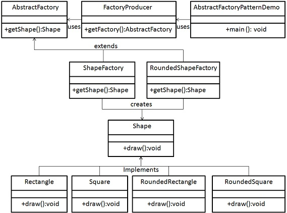

# Design Pattern
This repository includes the examples from the [Design Pattern Quick Guide](https://www.tutorialspoint.com/design_pattern/design_pattern_quick_guide). Notes includes my thoughts and the good comments from the cited websites.

### Background
- According to initial authors design patterns are primarily based on the following principles.
    - Program to an interface not an implementation
    - Favor object composition over inheritance
- **Usage of Design Pattern**
    - Design patterns provide a standard terminology and are specific to particular scenario.
    - Design patterns provide best solutions to certain problems faced during software development.
- **Types of Design Pattern**
    - Creational Patterns
        - These design patterns provides way to create objects while hiding the creation logic, rather than instantiating objects directly using new operator. This gives program more flexibility in deciding which objects need to be created for a given use case.
    - Structural Patterns
        - These design patterns concern class and object composition. Concept of inheritance is used to compose interfaces and define ways to compose objects to obtain new functionalities.
    - Behavioral Patterns
        - These design patterns are specifically concerned with communication between objects.
    - J2EE Patterns
        - These design patterns are specifically concerned with the presentation tier. These patterns are identified by Sun Java Center.

   
## Creational Patterns
### Factory Pattern
- Factory Pattern is under creational pattern. It's under Creational Pattern.
- Implementation
    - In Factory pattern, we create object without exposing the creation logic to the client and refer to newly created object using a common interface.
    - [Factory Pattern Example](FactoryPattern)
    

### Abstract Factory Pattern
- Abstract Factory patterns work around a super-factory which creates other factories. This factory is also called as factory of factories. Under creational patterns.
- Implementation
    - [Abstract Factory Pattern Example](AbstractFactoryPattern)
        

### Singleton Pattern
- This pattern involves a single class which is responsible to creates own object while making sure that only single object get created. Under  creational pattern.
- Implementation
    - [Singleton Pattern Example](SingletonPattern)
     

### Builder Pattern
- Builder pattern builds a complex object using simple objects and using a step by step approach. This builder is independent of other objects. It is under creational pattern.
- Implementation : a business case of fast-food
- [Builder Pattern Example](BuilderPattern)
 

### Prototype Pattern
- Prototype pattern refers to creating duplicate object while keeping performance in mind. This pattern involves implementing a prototype interface which tells to create a clone of the current object. It is used when creation of object directly is costly. It is under creational pattern.
- For example, a object is to be created after a costly database operation. We can cache the object, returns its clone on next request and update the database when needed thus reducing database calls.
- [Prototype Pattern Example](PrototypePattern)
 
- [What is Interface Cloneable](https://docs.oracle.com/javase/7/docs/api/java/lang/Cloneable.html)

  
## Structural pattern
### Adapter Pattern
- Adapter pattern works as a bridge between two incompatible interfaces. It is under structural pattern.
- Implementation ：an audio player device can play mp3 files only and wants to use an advanced audio player capable of playing vlc and mp4 files.
    - [Adapter Pattern Example](AdapterPattern)
      

### Bridge Pattern
- Bridge Pattern is used where we need to decouple an abstraction from its implementation so that the two can vary independently. It is under structural pattern.
- This pattern involves an interface which acts as a bridge which makes the functionality of concrete classes independent from interface implementer classes. Both types of classes can be altered structurally without affecting each other.
- Implementation
    - [Bridge Pattern Example](BridgePattern)
     

### Filter/Criteria Pattern
- Filter pattern or Criteria pattern is a design pattern that enables developers to filter a set of objects, using different criteria, chaining them in a decoupled way through logical operations. This type of design pattern comes under structural pattern as this pattern is combining multiple criteria to obtain single criteria.
- [Filter/Criteria Pattern](FilterOrCriteria)
 

### Composite Pattern
- Composite pattern is used where we need to treat a group of objects in similar way as a single object. Composite pattern composes objects in term of a tree structure to represent part as well as whole hierarchy.
- This pattern creates a class contains group of its own objects. This class provides ways to modify its group of same objects.
- Implementation
    - [Composite Pattern Example](CompositePattern)
     

### Decorator Pattern
- Decorator pattern allows to add new functionality an existing object without altering its structure. This type of design pattern comes under structural pattern as this pattern acts as a wrapper to existing class.
- This pattern creates a decorator class which wraps the original class and provides additional functionality keeping class methods signature intact.
- Implementation
    - [Decorator Pattern Example](DecoratorPattern)
     

### Facade Pattern
- Facade pattern hides the complexities of the system and provides an interface to the client using which the client can access the system. This type of design pattern comes under structural pattern as this pattern adds an interface to exiting system to hide its complexities.
- This pattern involves a single class which provides simplified methods which are required by client and delegates calls to existing system classes methods.
- Implementation
 - [Facade Pattern Example](FacadePattern)
  

### Flyweight Pattern
 - Flyweight pattern is primarily used to reduce the number of objects created, to decrease memory footprint and increase performance. This type of design pattern comes under structural pattern as this pattern provides ways to decrease objects count thus improving application required objects structure.
 - Flyweight pattern try to reuse already existing similar kind objects by storing them and creates new object when no matching object is found. We'll demonstrate this pattern by drawing 20 circle of different locations but we'll creating only 5 objects.
 - Implementation
  - [Flyweight Pattern Example](FlyweightPattern)
   

### Proxy Pattern
- In Proxy pattern, a class represents functionality of another class. In Proxy pattern, we create object having original object to interface its functionality to outer world.
- Implementation
 - [Proxy Pattern Example](ProxyPattern)
  

   
## Behavioral Patterns

### Chain of Responsibility Pattern
- As the name suggest, the chain of responsibility pattern creates a chain of receiver objects for a request. This pattern decouples sender and receiver of a request based on type of request.
- In this pattern, normally each receiver contains reference to another receiver. If one object cannot handle the request then it passes the same to the next receiver and so on.
- Implementation
 - [Chain of Responsibility Pattern Example](ChainOfResponsibilityPattern)
  

### Command Pattern
- Command pattern is a data driven design pattern and falls under behavioral pattern category. A request is wrapped under a object as command and passed to invoker object. Invoker object looks for the appropriate object which can handle this command and pass the command to the corresponding object and that object executes the command.
- Implementation
 - [Command Pattern Example](CommandPattern)
  

### Interpreter Pattern
- Interpreter pattern provides way to evaluate language grammar or expression. This type of pattern comes under behavioral patterns. This pattern involves implementing a expression interface which tells to interpret a particular context. This pattern is used in SQL parsing, symbol processing engine etc.
- Implementation
    - [Interpreter Pattern Example](InterpreterPattern)
     

### Iterator Pattern
-  This pattern is used to get a way to access the elements of a collection object in sequential manner without any need to know its underlying representation. It is under behavioral pattern category.
- Java has [Iterator Interface](https://docs.oracle.com/javase/8/docs/api/java/util/Iterator.html).
- [Iterator Pattern Example](IteratorPattern)
 
