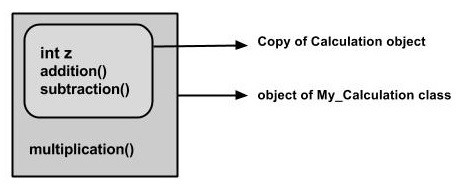

# Java
This repository includes the examples from the [Java Quick Guide](https://www.tutorialspoint.com/java/java_quick_guide),  [geeksforgeeks](https://www.geeksforgeeks.org/) and [The Java™ Tutorials](https://docs.oracle.com/javase/tutorial/index.html). Notes includes my thoughts and the good comments from the cited websites.

### Basic
- **variable**
  - Variables are nothing but reserved memory locations to store values.
  ```java
  //byte is type
  //a is variables
  //68 is Literal
  byte a = 68;
  ```

- **Miscellaneous Operators**
  - Conditional Operator ( ? : )
    - Maybe the syntactic sugar for if..else.. [Example](Basic/ConditionalOperator.java)
  - instanceof Operator
    - This operator is used only for object reference variables. The operator checks whether the object is of a particular type (class type or interface type). [Example](Basic/InstanceofTest.java)
    - It is more like the functional programming feature. Not very OOP.

- **Enhanced for loop in Java**
  - It mainly used to traverse collection of elements including arrays.
  ```java
  for(declaration : expression) {/* Statements*/}
  ```

- **wrapper classes**
  - All the wrapper classes (Integer, Long, Byte, Double, Float, Short) are subclasses of the abstract class Number. Number has a set of methods we can use to manipulate wrapper classes.
  ```java
  public class Test {
     public static void main(String args[]) {
        Integer x = 5; // boxes int to an Integer object
        x =  x + 10;   // unboxes the Integer to a int
        System.out.println(x);
      }
  }
  ```

- **Character Class**
  - The Character class offers a number of useful class (i.e., static) methods for manipulating characters.
  ```java
  Character ch = new Character('a');
  ```

- **Strings Class**
  - In Java programming language, strings are treated as objects.
  - Creating Format Strings
  ```java
  System.out.printf("The value of the float variable is " +
                  "%f, while the value of the integer " +
                  "variable is %d, and the string " +
                  "is %s", floatVar, intVar, stringVar);
  // Use format() to reuse formatted string.
  String fs;
  fs = String.format("The value of the float variable is " +
                     "%f, while the value of the integer " +
                     "variable is %d, and the string " +
                     "is %s", floatVar, intVar, stringVar);
  System.out.println(fs);
  ```

- **Arrays**
  - syntax
  ```java
  //Declare array
  double[] myList;   // preferred way.
  //Creating array
  double[] myList = new double[10];
  //For each loops
  double[] myList = {1.9, 2.9, 3.4, 3.5};
  for (double element: myList) {
      System.out.println(element);
  }
  //Passing and returning Arrays to Methods
  public static int[] reverse(int[] list) {
       int[] result = new int[list.length];
       for (int i = 0, j = result.length - 1; i < list.length; i++, j--) {
          result[j] = list[i];
       }
       return result;
  }
  ```

- **Measuring Elapsed Time**
    - [Example](Basic/MeasuringElapsedTime.java)
      ```java
      long start = System.currentTimeMillis( );
      //Your tasks
      long end = System.currentTimeMillis( );
      long diff = end - start;
      System.out.println("Difference is : " + diff);
      ```

- **Method Overloading**
  - When a class has two or more methods by the same name but different parameters, it is known as method overloading. It is different from overriding. In overriding, a method has the same method name, type, number of parameters, etc. [Example](Basic/ExampleOverloading.java)

- **Using Command-Line Arguments**
    - A command-line argument is the information that directly follows the program's name on the command line when it is executed. [Example](Basic/CommandLine.java)

- **The this keyword**
  - **this** is a keyword in Java which is used as a reference to the object of the current class, with in an instance method or a constructor.
  - explicit constructor invocation
  ```java
      class Student {
        int age;
        Student() { this(20); }
        Student(int age) { this.age = age;}
      }
  ```

- **Variable Arguments(var-args)**
  - pass a variable number of arguments of the same type to a method. Must be the last parameter.
  > typeName... parameterName

  - [Example](Basic/VarargsDemo.java)
  ```java
    public static void printArray(double... numbers){
      for(double num : numbers)
        System.out.print(num + " ");
    }
  ```

- **The finalize( ) Method**
  - will be called just before an object's final destruction by the garbage collector. It can be used to ensure that an object terminates cleanly. if your program ends before garbage collection occurs, finalize( ) will not execute.
  ```java
    protected void finalize( ) {
     // finalization code here
    }
  ```

- [**strictfp keyword**](https://www.geeksforgeeks.org/strictfp-keyword-java/)
  - strictfp is a keyword in java used for restricting floating-point calculations and ensuring same result on every platform while performing operations in the floating-point variable. [Code](Basic/StrictfpExp.java)

- [**Serialization and Deserialization**](https://www.geeksforgeeks.org/serialization-in-java/)
  - Serialization is a mechanism of converting the state of an object into a byte stream. Deserialization is the reverse process where the byte stream is used to recreate the actual Java object in memory.
  - Usage:
    - To save/persist state of an object.
    - To travel an object across a network.
  - Static data members and transient data members are not saved via Serialization process. See the [Code](Basic/SerializationExp.java):
  ```java
  transient int a;
  static int b;
  ```
  These two variables not saved via Serialization process.

### Access control
- **Package**
  - Detail see **\<Thinking in Java Access\>** Chapter Access Control. See [examples](AccessControl/Package).
  - On Mac:
    - Set CLASSPATH in .bash_profile
    - source .bash_profile

- **Class/Static Variables**
  - Only one copy of each class variable per class
  - Can be used with final to set variable as constant. [Example](AccessControl/Employee.java)

- [**Access Modifiers**](https://www.tutorialspoint.com/java/java_access_modifiers.htm)
  - Using the private modifier is the main way that an object encapsulates itself and hides data from the outside world.
  - Protected access gives the subclass a chance to use the helper method or variable, while preventing a nonrelated class from trying to use it.
  - Access Control and Inheritance [Example](AccessControl/Dog.java).
    - Methods declared public in a superclass also must be public in all subclasses.
    - Methods declared protected in a superclass must either be protected or public in subclasses; they cannot be private.=
    - Methods declared private are not inherited at all, so there is no rule for them.

### Files and I/O
- **Stream**
    - Byte Streams
        - Java byte streams are used to perform input and output of 8-bit bytes. the most frequently used classes are, **FileInputStream** and **FileOutputStream**.
    - Character Streams
        - Java Character streams are used to perform input and output for 16-bit unicode. Most frequently used classes are, **FileReader** and **FileWriter**.
    - Standard Streams. [Example](IO/ReadConsole.java)
        - support for standard I/O where the user's program can take input from a keyboard and then produce an output on the computer screen. Three standard streams:
            - **Standard Input**: System.in
            - **Standard Output**: System.out
            - **Standard Error**: System.err
    - [Examples](IO/CopyFile.java)

- **hierarchy**
    - a hierarchy of classes to deal with Input and Output streams.
    

- [**File Class**](https://www.tutorialspoint.com/java/java_file_class.htm)
    - This class is used for creation of files and directories, file searching, file deletion, etc. The File object represents the actual file/directory on the disk. [Example](IO/FileDemo.java)

- **Directories**
    - A directory is a File which can contain a list of other files and directories. You use File object to manipulate directories.
    ```java
    // Create directory.
    String dirname = "temp/temp2";
    File d = new File(dirname);
    d.mkdirs();

    //Listing Directories
    file = new File("/tmp");
    paths = file.list();
    for(String path:paths){
        System.out.println(path);
    }
    ```


### Object and Classes
- **Constructors**
  - Java automatically provides a default constructor that initializes all member variables to zero. However, once you define your own constructor, the default constructor is no longer used.

- **Abstract Class**
  - An abstract class can never be instantiated. It cannot be both abstract and final (since a final class cannot be extended).
  - An abstract class may contain both abstract methods as well normal methods.

- [**How to Use Singleton Class**](https://www.tutorialspoint.com/java/java_using_singleton.htm)
  - The Singleton's purpose is to control object creation, limiting the number of objects to only one. Singletons often control access to resources, such as database connections or sockets. [Code](ObjectAndClass/SingletonDemo.java)
- **Nested Classes**
    - Inner Classes
        - Inner classes are a security mechanism in Java. Normal class can not be made private, but the inner class can. Inner classes are of three types
            1. Inner Class
            2. Method-local Inner Class
            3. Anonymous Inner Class
        - Inner Class
            - just need to write a class within a class, can be set as private.
            - Can use the inner class to access the private members of a class. [Examples](ObjectAndClass/InnerClass).
            ```java
            //instantiate the inner class
            Outer_Demo outer = new Outer_Demo();
            Outer_Demo.Inner_Demo inner = outer.new Inner_Demo();
            ```
        - [Method-local Inner Class](ObjectAndClass/InnerClass/Outerclass.java)
            - In Java, we can write a class within a method and this will be a local type. Like local variables, the scope of the inner class is restricted within the method.
        - Anonymous Inner Class
            - Anonymous Inner Class  s the inner class declared without a class name. We declare and instantiate it at the same time.Generally, they are used whenever you need to override the method of a class or an interface.
            - [Example](ObjectAndClass/InnerClass/Outer_class.java)
            ```java
            AnonymousInner an_inner = new AnonymousInner() {
                public void my_method() { /*your codes */}   
            };
            ```
            - Anonymous Inner Class as Argument [example](ObjectAndClass/InnerClass/AnonymousInnerClassArgument.java)
            ```java
            obj.my_Method(new My_Class() {
                public void Do() {}
            });
            ```

    - [Static Nested Class](ObjectAndClass/InnerClass/Outer.java)
        - Static Nested Class can be accessed without instantiating the outer class, using other static members. Can't access to the instance variables and methods of the outer class
        ```java
        class MyOuter {
           static class Nested_Demo {
           }
        }
        ```
    - hierarchy of Nested Classes
    

### Inheritance
- **extends Keyword**
    - used to inherit the properties of a class.
    - Syntax
    ```java
    class Super {}
    class Sub extends Super {}
    ```
    - Structure of [Sample code](OOP/My_Calculation.java).
    
- [**The super keyword**](OOP/Sub_class.java)
    - It is used to differentiate the members of superclass from the members of subclass, if they have same names.
    - It is used to invoke the superclass constructor from subclass. Constructors are not members, so they are not inherited by subclasses
- [**Invoking Superclass Constructor**](OOP/Subclass.java)
    - The subclass automatically acquires the default constructor of the superclass.
    - But you need to use the super keyword to call a parameterized constructor of the superclass.
    ```java
    super(values);
    ```
- **IS-A Relationship**
    - Subclass is a Superclass
    - the **implements** keyword is used with classes to inherit the properties of an interface. Interfaces can never be extended by a class.
    ```Java
    public interface Animal {}
    public class Mammal implements Animal {}
    public class Dog extends Mammal {}
    ```
    - Use the **instanceof** operator to check IS-A Relationship. [Sample](OOP/Dog.java).
- **HAS-A relationship**
    - This determines whether a certain class HAS-A certain thing. This relationship helps to reduce duplication of code as well as bugs.
    ```java
    //This shows that class Van HAS-A Speed
    public class Vehicle{}
    public class Speed{}
    public class Van extends Vehicle {
       private Speed sp;
    }
    ```
- Types of Inheritance
    - Java does not support multiple inheritance but can implement one or more interfaces. C++ support  multiple inheritance.


### Overriding
- Overriding means to override the functionality of an existing method. It helps Subclass to override the method that is not marked final.
- super keyword is used to invoke the superclass' overridden method. [Sample code](OOP/TestDog.java).

### Polymorphism
- The most common use of polymorphism in OOP occurs when a parent class reference is used to refer to a child class object.
```java
public interface Vegetarian{}
public class Animal{}
public class Deer extends Animal implements Vegetarian{}
// All the reference variables d, a, v, o refer to the same Deer object in the heap
Deer d = new Deer();
Animal a = d;
Vegetarian v = d;
Object o = d;
```
- **virtual method invocation**
    - In compile time, the check is made on the reference type. However, in the runtime, JVM figures out the object type and would run the method that belongs to that particular object. [Sample code](OOP/TestDog.java)

### Abstraction
- Abstraction is a process of hiding the implementation details from the user, only the functionality will be provided to the user.
-  If inheriting an abstract class, Subclass must provide implementations to all the abstract methods. [Sample code](OOP/AbstractDemo)

### Encapsulation
- To achieve encapsulation in Java
    1. Declare the variables of a class as private.
    2. Provide public setter and getter methods to modify and view the variables values.
- Benefits
    1. The fields of a class can be made read-only or write-only.
    2. A class can have total control over what is stored in its fields
- [Sample code](OOP/RunEncap.java)


### Exceptions
- **Checked Exceptions**: exceptions that are checked by the compiler at compilation-time, these are also called as compile time exceptions.
    - [Example](Exceptions/FilenotFound_Demo.java)
    ```java
        //Can't compile, FileNotFoundException exception.
        File file = new File("E://file.txt");
        FileReader fr = new FileReader(file);
    ```

- **Unchecked Exceptions**: occurs at the time of execution, also called as Runtime Exceptions, include programming bugs etcs.
    - Example:
    ```java
        //ArrayIndexOutOfBoundsExceptionexception at Runtime.
        int num[] = {1, 2, 3, 4};
        System.out.println(num[5]);
    ```

- **Errors**: These are not exceptions at all. Errors are generated to indicate errors generated by the runtime environment. Example: JVM is out of memory. Normally, programs cannot recover from errors.

- **Exception Hierarchy**
    - [Built-in Exceptions](https://www.tutorialspoint.com/java/java_builtin_exceptions.htm)
    <p align="center">
        
    </p>

- **Catching Exceptions**
    - Code within a try/catch block is referred to as protected code
    - Exceptions caught by sequence, ExceptionTypes are better listed from specific to general.
    - A finally block of code always executes. It allows you to run any cleanup-type statements, no matter what happens in the protected code.
    - [Example](Exceptions/ExcepTest.java)
    ```java
        try {
        // Protected code
        } catch (ExceptionType1|ExceptionType2 e1) {
            // Catching Multiple Type of Exceptions, since java 7
            // Catch block
        } catch (ExceptionType3 e3) {
           // Catch block
        } catch (ExceptionType4 e4) {
           // Catch block
        }finally {
        // The finally block always executes.
        }
    ```

- **The Throws/Throw Keywords**
    - If a method does not handle a checked exception, the method must declare it using the throws keyword.
    - throws is used to postpone the handling of a checked exception
    - throw is used to invoke an exception explicitly.
    ```java
    // throws more than one exception
    import java.io.*;
    public class className {
       public void withdraw(double amount) throws RemoteException, InsufficientFundsException {
          // Method implementation
          throw new RemoteException();
       }
       // Remainder of class definition
    }
    ```
- [**The try-with-resources**](https://docs.oracle.com/javase/tutorial/essential/exceptions/tryResourceClose.html)
    - try-with-resources, also referred as automatic resource management, helps to automatically close the resources used within the try catch block.
    - [Example](Exceptions/ReadData_Demo.java) that not uses try-with. More complicated. Error prone.
    - [Example](Try_withDemo/ReadData_Demo.java) that uses try-with. More concise and easy to write.
    ```java
    try(FileReader fr = new FileReader("file path")) {
    // use the resource
    } catch () {
      // body of catch
    }
    ```
- **User-defined Exceptions**
    - All exceptions must be a child of Throwable.
    - If you want to write a checked exception, you need to extend the **Exception** class.
    - If you want to write a runtime exception, you need to extend the RuntimeException class.
    - [Examples](Exceptions/UserDefinedException)
    ```java
    class MyException extends Exception { }
    ```

### Multithreading
- [**volatile keyword in Java**](https://www.geeksforgeeks.org/volatile-keyword-in-java/)
  - **Mutual Exclusion**: It means that only one thread or process can execute a block of code (critical section) at a time.
  - **Visibility**: It means that changes made by one thread to shared data are visible to other threads.
  - Volatile variables have the visibility features of synchronized but not the atomicity features. The values of volatile variable will never be cached and all writes and reads will be done to and from the main memory.
- [**Synchronized in Java**](https://www.geeksforgeeks.org/synchronized-in-java/)
  - All synchronized blocks synchronized on the same object can only have one thread executing inside them at a time. All other threads attempting to enter the synchronized block are blocked until the thread inside the synchronized block exits the block. [Code](Multithreading/SyncDemo.java).
  - This synchronization is implemented in Java with a concept called monitors. I have learned this in OS course. See it [here](https://github.com/XuShaoming/UB_COURSES/blob/master/Operating%20System/Lecture_09__Process_Synchronization__II.pdf).

- $k_{n+1} = n^2 + k_n^2 - k_{n-1}$
